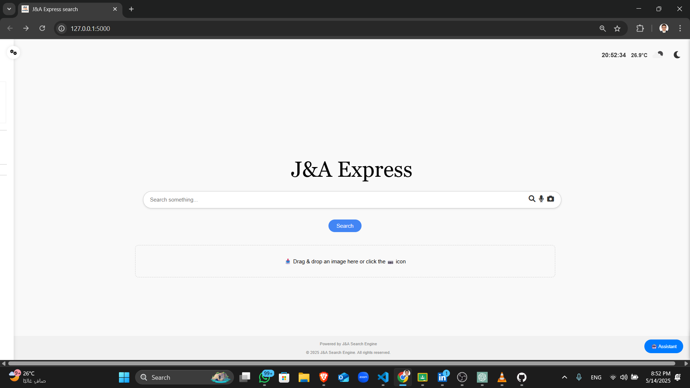

# J&A Express search engine

Click on the image to watch the demo video!!

J&A Express search engine is a multilingual, web-based search engine built with Flask. It supports advanced information retrieval models and provides a user-friendly interface for searching and exploring a custom document corpus.

## Features

- **Multiple Retrieval Models:**  
  Supports TF-IDF, BM25, PL2, Unigram, Word2Vec (CBOW & Skip-gram), RNN, and LSTM models for document ranking.

- **Query Expansion:**  
  Optional RM3-based query expansion for improved search relevance (works with BM25 and PL2).

- **Multilingual Interface:**  
  User interface supports English, French, German, Chinese, and Arabic.

- **Image Support:**  
  Allows users to upload or drag-and-drop images for enhanced search experiences.

- **Voice Search:**  
  Users can search using their voice for a hands-free experience.

- **AI Assistant:**  
  Integrated AI assistant to help users with search queries, suggestions, and navigation.

- **Favorites & History:**  
  Users can mark favorite results and view their search history.

- **Pagination & Custom Page Size:**  
  Results are paginated with adjustable page size for better navigation.

## Project Structure

- `app.py` — Main Flask application and API endpoints.
- `models/` — Retrieval models and query expansion logic.
- `static/` — Frontend assets (JS, CSS, images).
- `templates/` — HTML templates for the web interface.
- `utils/` — Utility scripts and helpers.
- `corpus_index/`, `myIndex2/` — Index and search data.
- `Datasets/` — Raw and processed datasets.
- `README.md` — Project documentation.

## Getting Started

1. **Install dependencies:**
   pip install -r requirements.txt

2. Run the application: python app.py

3. Access the interface:
Open http://localhost:5000 in your browser.

## Usage: 
- Enter a search query, select a retrieval model, and (optionally) enable RM3 query expansion.
- Browse, favorite, and explore results.
- Switch interface language as needed.
